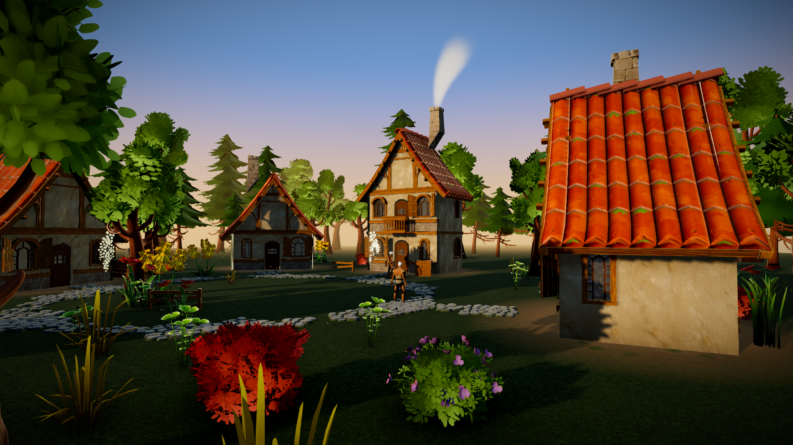

# Emberwick Vale — 3D vertical slice (Three.js)

A browser-based third-person vertical slice: a stylized medieval hamlet at golden
hour, built from CC0 assets (Quaternius Medieval Village MegaKit + Stylized Nature
MegaKit + Universal Animation Library) on a Vite + TypeScript + Three.js stack.



## Run

```bash
npm install          # once (also: npx playwright install chromium for the tools)
npm run dev          # dev server -> http://127.0.0.1:5173
npm run build        # type-check + production build into dist/
npm run preview      # serve the production build
npm run shots        # automated screenshot loop (named cameras -> docs/screenshots/)
```

Optional tool scripts: `node tools/playtest.mjs [--headed]` (scripted walk +
interaction test), `node tools/perftest.mjs` (headed GPU perf measurement),
`node tools/smoketest_dist.mjs` (production-build smoke test).

## Controls

- **Spielen** button on the title screen starts the game and captures the mouse
  (after Esc, click the canvas to re-capture) — mouse orbits the camera
- **W A S D / arrows** move (camera-relative), **Shift** run, **wheel** zoom
- **E** interact (the tavern door shows a prompt when close)

## What's in the slice

- ~96 m playable vale: tavern "The Gilded Sheaf" (primary landmark, two storeys,
  balcony, chimney smoke), stone watchtower (secondary landmark), three cottages,
  rock-path network, dense nature dressing, two silhouette tree rings + warm fog
- Furnished tavern taproom (KayKit dungeon props): decorated tables, chairs,
  keg, barrels, shelves, candlelight + flickering hearth glow, torches flanking
  the door
- Wildlife & foreshadowing: a small deer herd grazes the NW meadow (graze/wander/
  flee behaviour — they gallop off when approached); a dormant skeleton camp
  waits at the SE forest edge (combat phase not implemented yet)
- Player character (Quaternius universal rig: base body + peasant outfit + hair
  composited onto one skeleton) with idle/walk/run driven by the Universal
  Animation Library; one NPC villager
- Rendering: ACES tone mapping, HDRI image-based lighting (lighting only — the
  visible sky is a palette-matched gradient dome with sun glow), PCFSoft shadows,
  N8AO ambient occlusion, mipmap bloom, SMAA, vignette, warm grade, golden-hour fog
- Ambient motion: drifting pollen, chimney smoke, swaying grass/flowers/trees
- three-mesh-bvh collision (capsule collide-and-slide with sub-stepping, camera
  occlusion pull-in, ground snap)
- Repeated props (scatter vegetation, rocks, path stones, silhouette tree rings)
  GPU-instanced — one draw call per unique piece, sway kept via per-instance
  matrix updates

## Project docs

- `docs/VISUAL_SPEC.md` — art direction, palette, bake-off scores, composition
- `docs/ASSET_MANIFEST.md` — every asset with source + license (all CC0)
- `docs/PROJECT_STATE.md` — dated screenshot-review log (18 iterations)
- `docs/screenshots/` — full progression + playtest captures
- `GAME_PROMPT.md` — original build brief

## Measured performance

Production build, Chromium (headed), RTX 4080, 1920×1080: 100 fps idle,
moving, and after resize; 822/734 draw calls (idle/moving), ~1.08 M triangles
rendered (instanced groups cull as a whole). Software WebGL (SwiftShader)
reaches ~12 fps — a dev-tooling reference only, not a target.

## Known limitations

- Only the tavern has a furnished interior (other doors open against empty
  rooms). Windows don't glow from inside at distance.
- Skeletons are dormant set-dressing — no combat/AI yet (their clip sets
  include awaken/attack/death animations, ready for the combat phase). Deer
  ignore scattered props while wandering.
- No audio (visual work was prioritized, per the brief).
- Terrain is flat; slope/step traversal is untested beyond path stones.
- `asset_staging/` (gitignored) holds the full downloaded packs and everything
  pruned from `public/assets` — restore from there if you extend the world.

## Next phase recommendation

Gameplay: skeleton combat (models + awaken/attack/death clips are in place, more
enemies staged: Wolf, Fox, Yeti, Orc), quest-giver dialogue on the NPC, day/night
cycle reusing the sky-dome shader, ambient audio (birds, wind, tavern murmur).
Visual quality is proven; systems (characters, clips, interaction, collision,
creature behaviour) are in place to build on.
